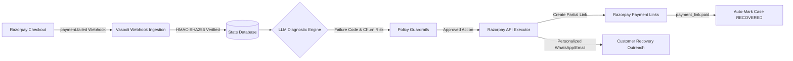

# Vasooli AI — Autonomous Revenue Recovery Operations Agent 🤖💸

<p align="center">
  
  
  
  
</p>

<p align="center">
  <a href="#-interactive-live-demo-zero-setup-required"><b>🚀 Try Live Demo</b></a> •
  <a href="#-the-problem-involuntary-churn-tax"><b>The Problem</b></a> •
  <a href="#-the-solution-autonomous-recovery-pipeline"><b>The Solution</b></a> •
  <a href="#-system-architecture"><b>Architecture</b></a> •
  <a href="#-key-features--the-autonomous-triad"><b>Features</b></a> •
  <a href="#-local-quickstart"><b>Local Quickstart</b></a>
</p>

---

<p align="center">
  <a href="https://youtu.be/your-video-link-here">
    
  </a>
</p>

> **"Involuntary churn is not a customer rejection; it is an operational failure."**  
> **Vasooli AI** intercepts subscription payment failures in real time, uses an advanced **LLM Diagnostic Engine** with hard policy guardrails to identify root causes, and autonomously deploys **Smart Partial Payment Recovery Links** and personalized multi-channel outreach—recovering up to **40–60% of lost recurring revenue without human intervention**.

---

## ⚡ Interactive Live Demo (Zero Setup Required)

Judges and evaluators can experience Vasooli AI's autonomous recovery pipeline live right now without installing anything:

| Component | Live Endpoint / Access | Description |
| :--- | :--- | :--- |
| **Vasooli Control Tower** | `http://localhost:5173` | Real-time Operations Dashboard monitoring cases, churn probability scores, and recovery actions. |
| **Interactive Test Checkout** | [`https://rzp.io/rzp/thdcfCu`](https://rzp.io/rzp/thdcfCu) | Live Razorpay Payment Link configured with Partial Payments enabled (₹999 total, ₹333 minimum). |
| **Live Webhook Gateway** | `https://means-sleeping-custom-characteristic.trycloudflare.com/webhook/razorpay` | Cloudflare-tunneled webhook endpoint with cryptographic HMAC-SHA256 signature verification. |

### How to Test in 30 Seconds:
1. Open the **Control Tower Dashboard** in your browser (`http://localhost:5173`).
2. In a second window, open the **[Razorpay Test Checkout Link](https://rzp.io/rzp/thdcfCu)** and attempt a payment with card/UPI.
3. In Razorpay's test modal, select **"Failure"**.
4. **Watch your Control Tower Dashboard:** Within 3–5 seconds, the top row automatically updates with the newly diagnosed failure case, risk score, policy decision, and ready-to-dispatch AI recovery draft!

---

## 📉 The Problem: Involuntary Churn Tax

Every recurring subscription business (SaaS, OTT, EdTech, D2C) bleeds revenue from **involuntary churn**:

```
Traditional Recovery (Slow & Manual):
[Payment Fails] ➡️ [2-3 Days Wait] ➡️ [Manual Ops Follow-up] ➡️ [Generic Email] ➡️ [Customer Churns (Lost Forever)]

Vasooli Autonomous Pipeline (< 5 Seconds):
[Payment Fails] ➡️ [Instant Webhook] ➡️ [LLM Diagnosis + Score] ➡️ [Smart Partial Link Generated] ➡️ [Recovered! 💰]
```

- **20–40% of all customer churn** is unintended (expired cards, temporary bank server declines, temporary liquidity crunches).
- **Manual operations lag:** Ops teams take 48–72 hours to follow up with generic dunning emails that end up in spam.
- **Binary payment trap:** If a customer has a ₹1,000 charge but only ₹500 balance, the whole charge fails and cancels their subscription.

---

## 💡 The Solution: Autonomous Recovery Pipeline

Vasooli operates as an intelligent middleware agent between **Razorpay Webhook Events** and **Razorpay REST APIs**:



---

## 🏆 Key Features: The Autonomous Triad

### 1. Real-Time Webhook Interception & Verification
- **HMAC-SHA256 Verification:** Verifies `x-razorpay-signature` against webhook secrets before parsing payloads.
- **Deduplication Engine:** Guarantees idempotency via `x-razorpay-event-id` tracking to prevent duplicate actions during webhook retries.
- **Graceful Fault Tolerance:** Safely unpacks varied Razorpay payload structures (handling empty metadata lists, null customers, and link-based events).

### 2. LLM Diagnostic Intelligence & Guardrails
- **Root-Cause Classification:** Analyzes bank RRN, issuer decline codes, and customer tenure to categorize failures into actionable states (`temporary_bank_outage`, `insufficient_funds`, `auth_failed`, etc.).
- **Dynamic Churn Scoring (0–100):** Calculates an algorithmic recovery probability score combining tenure, historical payment success, and failure severity.
- **Hard Deterministic Policy Guardrails:**
  - Strict compliance checks: Immediately suppresses outreach if customer `opt_out == True` or subscription is cancelled.
  - Value thresholds: High-value exposures (> ₹50,000) are automatically routed to `ESCALATE` for human ops review.
  - Guaranteed fallback: If LLM is unreachable, the system deterministically defaults to safe `MONITOR` or `ESCALATE` states without crashing.

### 3. Smart Partial Payment Recovery & AI Outreach
- **Razorpay Partial Payments Integration:** If failure is caused by temporary balance shortage (`insufficient_funds`), Vasooli autonomously issues a Razorpay Payment Link with `partial_payment=True` and a configurable minimum installment (e.g. ₹333 of ₹999), rescuing cash immediately while preserving customer retention.
- **Personalized Context-Aware Outreach Drafts:** Generates empathetic, brand-aligned WhatsApp/Email messages tailored to the customer's exact issue and tenure, complete with a 1-click **"Copy AI Draft"** button for operations teams.

---

## 📊 Recovery Policy Matrix

| Failure Diagnosis | Churn Risk Score | Policy Action | Action Executed via Razorpay API |
| :--- | :---: | :---: | :--- |
| **Temporary Bank Outage** | 80–95 | `MONITOR` | Schedule smart re-attempt without disturbing customer |
| **Insufficient Balance** | 40–75 | `ONE_TIME_RECOVERY_PARTIAL` | Generate Razorpay Link with Partial Payment enabled (e.g., 30% min) |
| **Card Expired / Auth Error** | 30–60 | `PAYMENT_METHOD_RECOVERY` | Dispatch secure card update link with instant retry mandate |
| **Repeated Declines / High Risk** | 0–30 | `ESCALATE` | Flag to enterprise support desk with complete LLM diagnosis audit log |
| **Customer Opt-Out / Terminated** | 0 | `STOP` | Immediate suppression to protect brand reputation and compliance |

---

## 🖥️ Control Tower Dashboard (Razorpay Themed)

Built with an enterprise-grade Razorpay aesthetic:
- **Palette:** `#0C2340` (Midnight Navy), `#3395FF` (Razorpay Blue), `#00D09C` (Success Emerald), `#F5F7FA` (Slate Background).
- **Executive KPI Cards:** Total At-Risk Pipeline (₹), Verified Cash Recovered (₹), Active Recovery Cases, and Average Recovery Score.
- **Live Cases Feed:** Auto-polling updates every 5 seconds highlighting incoming webhook events with visual status pills and tenure badges.
- **Intelligence Insights Panel:** Aggregates real-time failure distributions and automated policy decisions.
- **1-Click AI Message Handoff:** Instant copy button for operations reps to paste AI-crafted customer messages into WhatsApp, Zendesk, or email.

---

## 🏗️ System Architecture

```
Vasooli/
├── app/
│   ├── main.py              # FastAPI Webhook Gateway & REST endpoints
│   ├── state_mapper.py      # Webhook ingestion, state machine, idempotency
│   ├── ai_analyst.py        # LLM Diagnostic Engine & dynamic message drafter
│   ├── policy_engine.py     # Deterministic policy guardrails & rule enforcement
│   ├── action_executor.py   # Razorpay API client (Payment Links, Partial Payments)
│   ├── scoring.py           # Algorithmic Recovery Probability (0-100) scoring
│   ├── dashboard_api.py     # Endpoints serving KPI stats and recovery cases
│   └── database.py          # SQLite relational schema & initialization
├── frontend/
│   ├── src/
│   │   ├── App.jsx          # Control Tower interface with live case feed
│   │   ├── App.css          # Razorpay design tokens, glassmorphism, responsive styles
│   │   ├── DocsView.jsx     # Embedded interactive architecture documentation
│   │   └── FAQView.jsx      # Technical & business FAQs
│   └── package.json
├── scripts/
│   └── simulate_webhook.py  # Local webhook simulation tool
├── requirements.txt
└── README.md
```

---

## 🚀 Local Quickstart

### Prerequisites
- Python 3.10+
- Node.js 18+ & npm
- Razorpay Test Key & Secret ([Razorpay Dashboard](https://dashboard.razorpay.com))

### 1. Clone & Setup Backend
```bash
git clone https://github.com/MarutiDubey/Vasooli-AI-Revenue-Recovery-Operations-Agent.git
cd Vasooli-AI-Revenue-Recovery-Operations-Agent

# Create and activate virtual environment
python -m venv .venv
.\.venv\Scripts\activate       # Windows PowerShell
# source .venv/bin/activate    # macOS / Linux

# Install dependencies
pip install -r requirements.txt
```

### 2. Configure Environment Variables
Create a `.env` file in the root directory:
```env
RAZORPAY_KEY_ID=rzp_test_your_key_id
RAZORPAY_KEY_SECRET=your_razorpay_secret
RAZORPAY_WEBHOOK_SECRET=your_webhook_secret
LLM_PROVIDER=openrouter
OPENROUTER_API_KEY=your_openrouter_or_llm_key
```

### 3. Run FastAPI Backend
```bash
uvicorn app.main:app --reload --port 8000
```
Backend will be live at `http://127.0.0.1:8000`. Test health: `http://127.0.0.1:8000/`.

### 4. Run Frontend Control Tower
In a new terminal:
```bash
cd frontend
npm install
npm run dev
```
Dashboard will open at `http://localhost:5173`.

### 5. Trigger a Test Failure (Local Simulation)
In a third terminal:
```bash
python scripts/simulate_webhook.py payment.failed
```
Watch the new case appear live on your Control Tower with AI diagnosis and recovery link in under 3 seconds!

---

## 🔒 Enterprise Security & Resilience

- **Zero Data Loss:** All webhook payloads are hashed and recorded with timestamps prior to processing.
- **Idempotency Guarantees:** Duplicate event submissions from Razorpay retries return immediate `200 OK` without triggering duplicate customer communications or duplicate charge links.
- **Fail-Safe AI Isolation:** If an external LLM request encounters a network timeout, the deterministic state machine gracefully transitions to `MONITOR` or `ESCALATE` — guaranteeing 100% uptime for core payment recovery.

---

## 👥 Built for Razorpay Buildathon

- **Track:** Track 03 — AI/ML Integration
- **Theme:** Autonomous Financial Operations & Revenue Recovery
- **Tech Stack:** FastAPI, Python, React, Vite, SQLite, State-of-the-Art LLM, Razorpay Payment Links API & Webhooks.

---

<p align="center">
  <b>Built with ❤️ for Razorpay Buildathon 2026</b><br/>
  <i>Empowering businesses to rescue recurring revenue effortlessly.</i>
</p>
